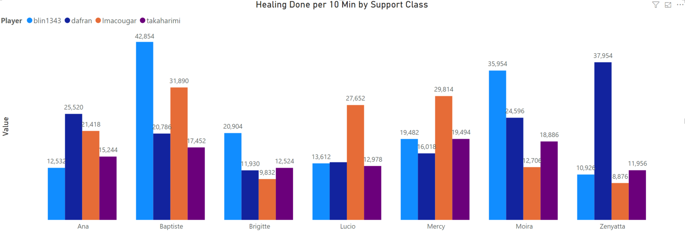
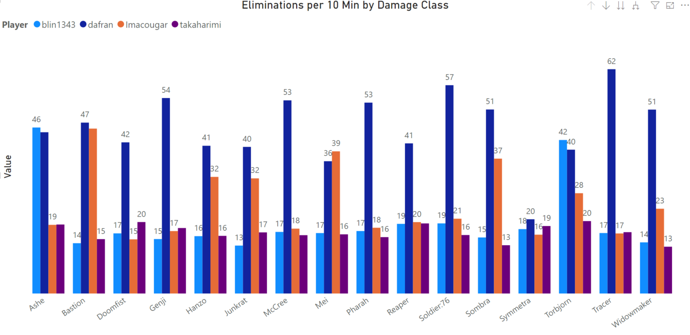
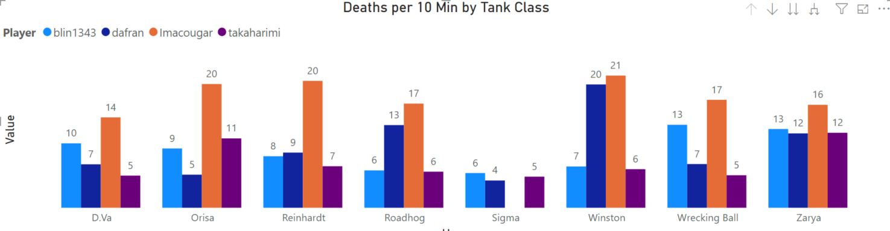
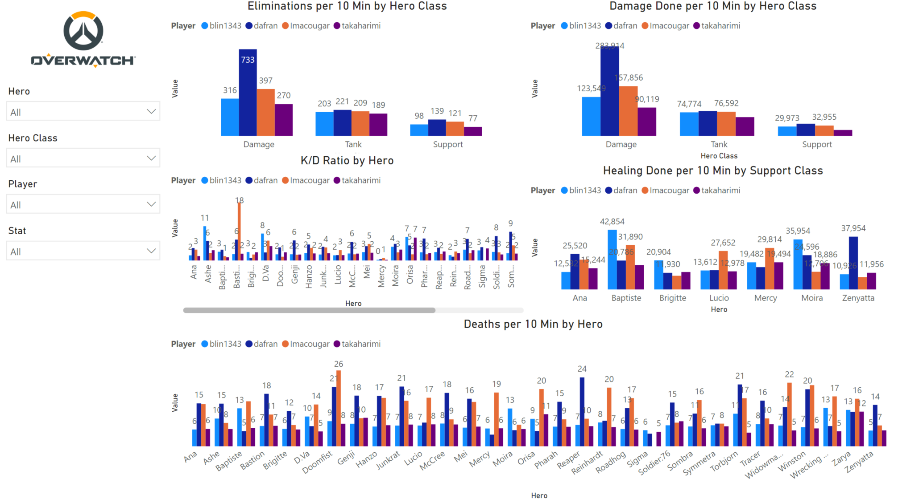

# Project Title: Overwatch Webscraper

Overwatch Webscraper Application that collects data on multiple players. The data is then used to compare in-game statistics so that the player can identify his/her strengths & weaknesses.

## Running the Program
We first define a function that takes the inputs of the player's region, gaming platform, and blizzard battletag id.
```
def Search(region, platform, battletag):
    url = "https://playoverwatch.com/{}/career/{}/{}".format(region, platform, battletag)
    header = {"User-Agent" : "Mozilla/5.0 (Windows NT 10.0; Win64; x64) AppleWebKit/537.36 (KHTML, like Gecko) Chrome/78.0.3904.108 Safari/537.36"}
    page = requests.get(url, headers=header)
```
We use BeautifulSoup to filter the HTML data down to the elements that hold the character name, player name, category name and the corresponding category value.
This data is then written to a local text file.
```
for characterName, characterID in Heroes.items():
       example = soup.findAll("div",{"data-category-id":characterID})
       for e in example:
          data = e.findAll("td",{"class":"DataTable-tableColumn"})
          for d in data:
             if header == True:
                title = d.get_text()
                OverwatchData.write(characterName + ","+ title + "," + url.split("/")[6].split("-")[0] + ",")
                header = False
             else:
                stats = d.get_text()
                header = True
                OverwatchData.write(stats + "\n")
       OverwatchData.write("\n")

    OverwatchData.close()
```
For every player you want to gather data for, call the Search function that was created to scrape their data. (Note: The player's Blizzard account must be set to public in order for the application to scrape the player's data.

```
Search("en-us", "pc", "takaharimi-1252")
counter+=1
Search("en-us", "pc", "blin1343-1104")
Search("en-us", "pc", "Imacougar-1290")
Search("en-us", "pc", "dafran-21192")
```
This imports the text file as a Pandas dataframe and exports it as an xlsx file to be consumed by a reporting tool.
```
Overwatch_Stats = pd.read_csv("C:/Users/Benny Lin/Desktop/Overwatch_Project/OverwatchMetricsApplication/OverwatchData.txt", encoding ='unicode_escape', names=["Hero", "Stat", "Player", "Value"])

Overwatch_Stats.to_excel("C:/Users/Benny Lin/Desktop/output.xlsx",sheet_name='Overwatch Stats', index=False)
```
## Built With
* [BeautifulSoup](https://pypi.org/project/beautifulsoup4/) - Library that makes it easy to scrape information from web pages.
* [Pandas](https://pandas.pydata.org/) - Open source, BSD-licensed library providing high-performance, easy-to-use data structures and data analysis tools
* [Requests](https://requests.readthedocs.io/en/master/) - Requests is an elegant and simple HTTP library for Python, built for human beings.

## Screenshot Examples of Overwatch Dashboard








## Contributers

[Sydnee Woodhouse](https://github.com/svwoodhouse)
